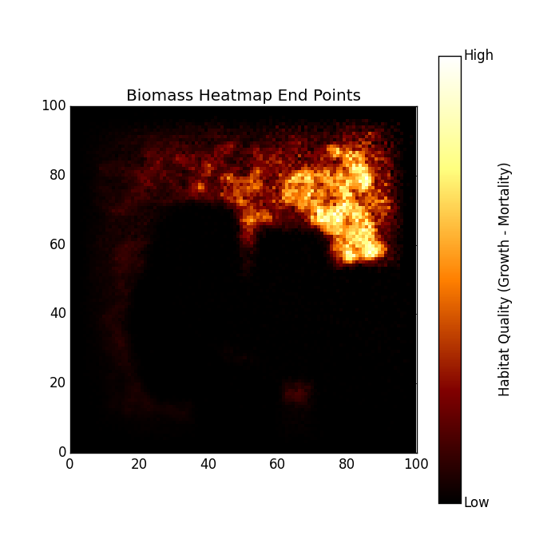

.. ex_biomass_heatmap:

====================================
Example - Cumulative Biomass Heatmap
====================================

This example will visualize the cumulative amount of biomass over time. This shows where the tracks were most concentrated for every tick.

Code
====

.. literalinclude:: ../../pytracks/test_suite/ex_biomass_heatmap.py
   :language: python

Output
======

