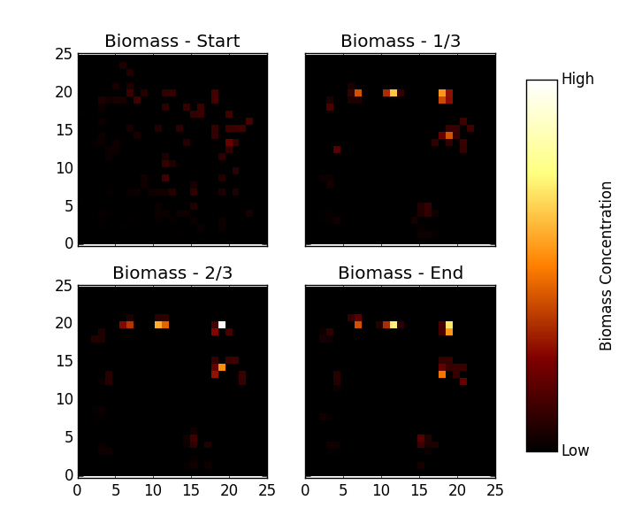

.. ex_biomass_heatmap_ticks:

===========================================
Example - Biomass Heatmap by Specific Ticks
===========================================

This example will visualize the biomass concentration for specific ticks.

Code
====

.. literalinclude:: ../../pytracks/test_suite/ex_biomass_heatmap_ticks.py
   :language: python

Output
======

