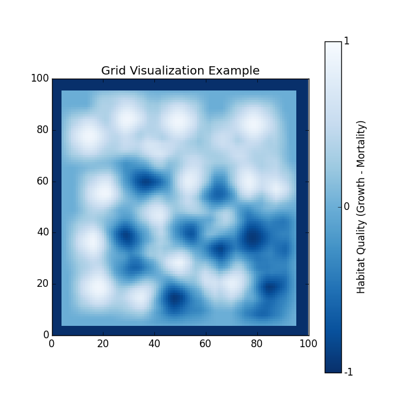

.. ex_grid:

============================
Example - Grid Visualization
============================

This example simply wraps a Grid data file and generates a graph visualizing it.

Code
====

.. literalinclude:: ../../pytracks/test_suite/ex_grid.py
   :language: python

Output
======

