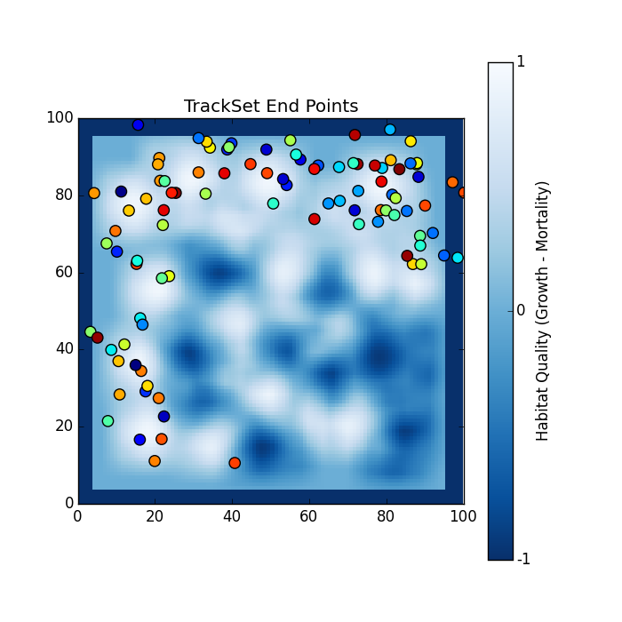

.. ex_random_tracks:

=========================
Example - Plot End Points
=========================

This example will visualize the end point of every track in the data file. The color of the dots have no correlation to the data. It is just there for visual purposes.

Code
====

.. literalinclude:: ../../pytracks/test_suite/ex_plot_end_points.py
   :language: python

Output
======

