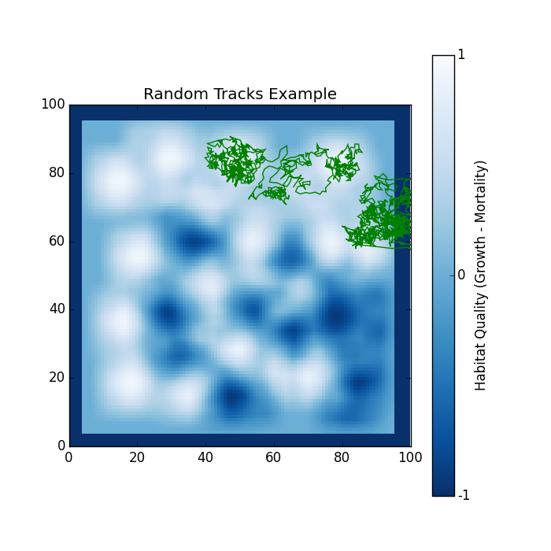

.. ex_random_tracks:

=======================
Example - Random Tracks
=======================

This example will visualize a random number of tracks from the data file. For simplicity, two were chosen.

Code
====

.. literalinclude:: ../../pytracks/test_suite/ex_random_tracks.py
   :language: python

Output
======

